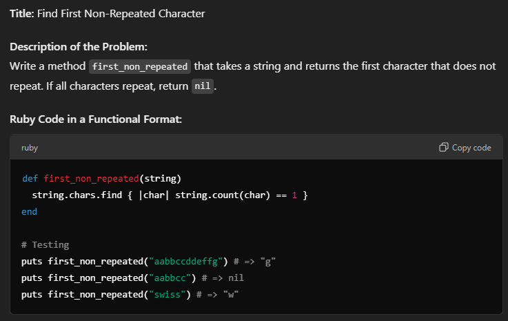
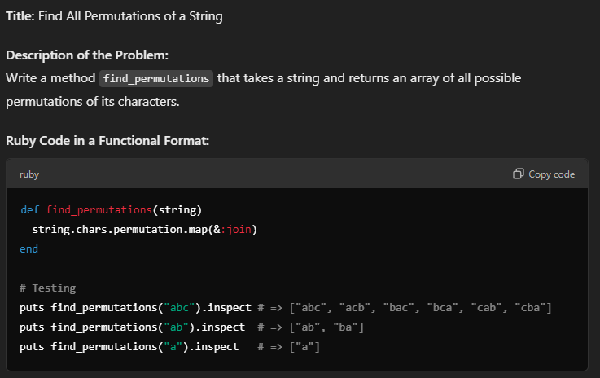
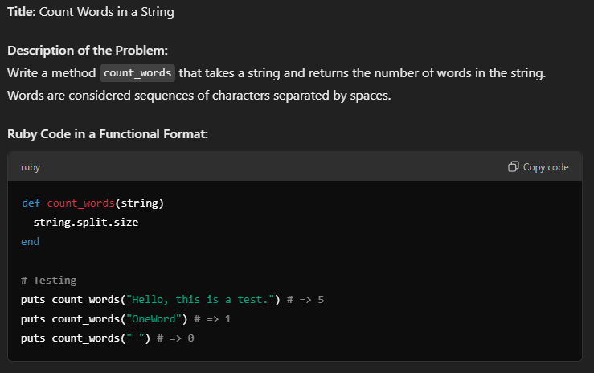
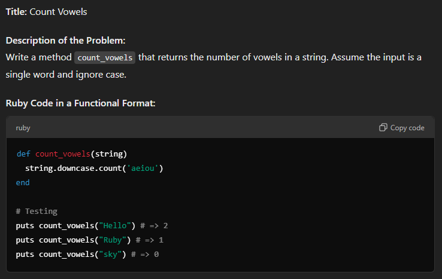
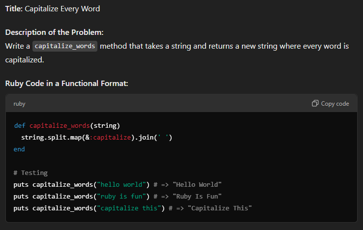
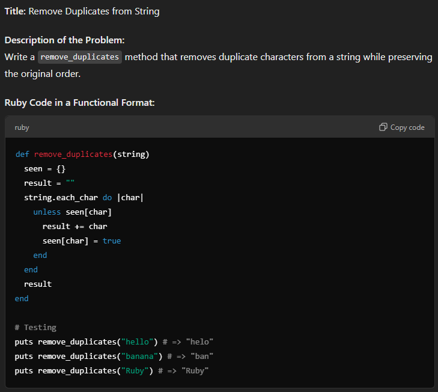
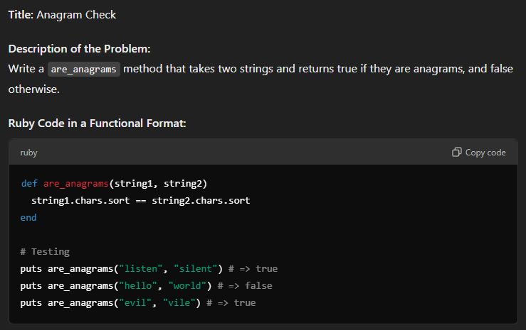
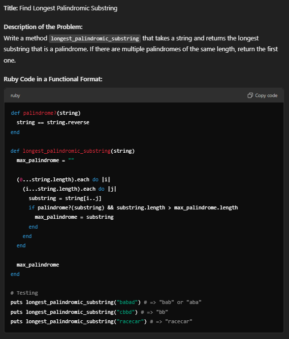
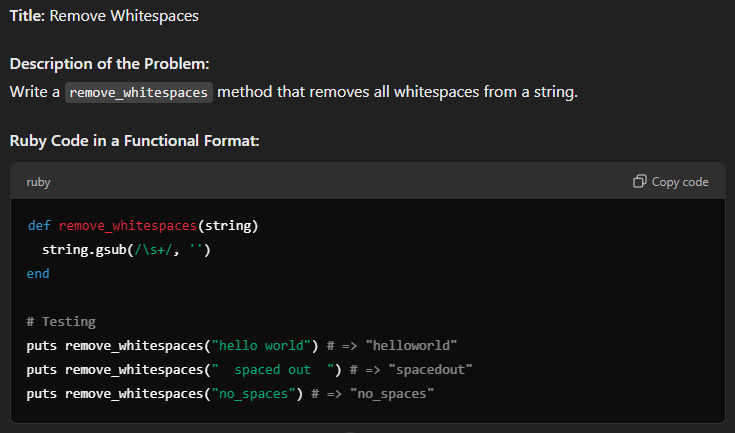

Strings: 
1. Find First Non-Repeated Character

    

2. Find All Permutations of a String

    

3. Count Words in a String 

    

4. Count Vowels: count_vowels() 

    

5. Capitalize Every Word: capitalize_words() 

    

6. Find All Unique Characters

    

7. Remove Duplicates from String 

    

8. Anagram Check

    

9. Find Longest Palindromic Substring 

    

10. Remove Whitespaces 

    

### Day 1
- Practice coding in Strings using Ruby Language. 