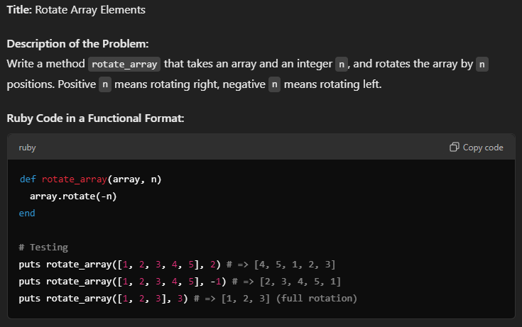

Arrays: 

1. Remove Duplicates 

    

2. Flatten A Nested Array 

    

3. Rotate Array Elements 

    

4. Find Unique Elements

    

5. Find Intersection of Two Arrays 
 
    

6. Find the Second Largest Element 

    

7. Sum of Even Numbers 

    

8. Merge Two Sorted Arrays 

    

9. Check if Array is Sorted

    

10. Find Missing Number in Sequence 

    
