Hashes: 

1. Find Key by Value

    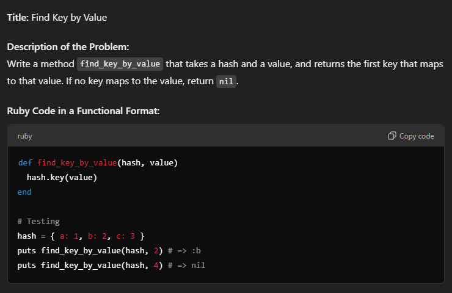

2. Merge Two Hashes 

    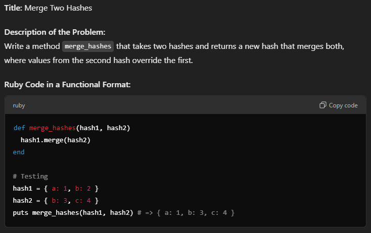

    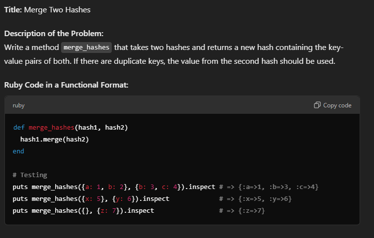

3. Convert Array to Hash 

    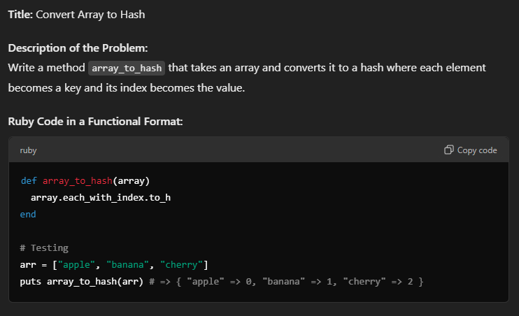

4. Count Frequencies 

    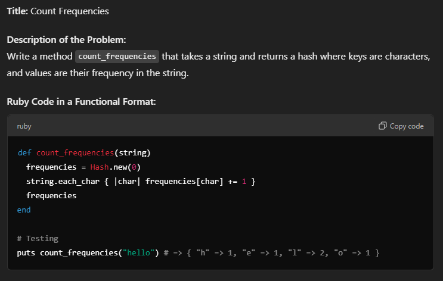

5. Invert Keys and Values 

    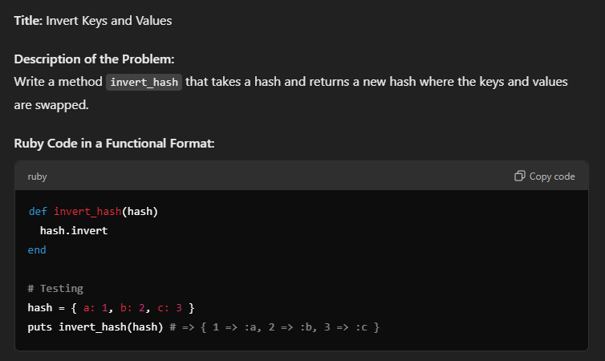

6. Delete Key-Value Pair by Key 

    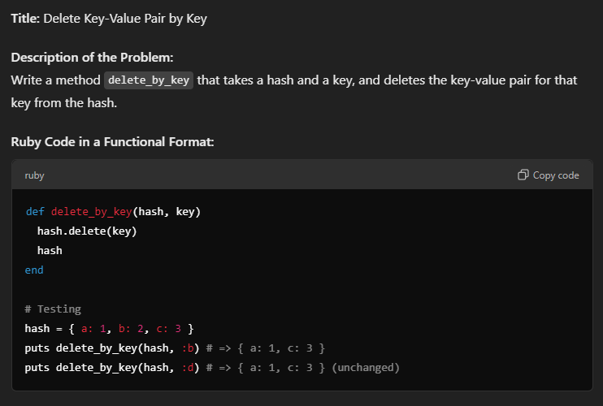

7. Check if Key Exists 

    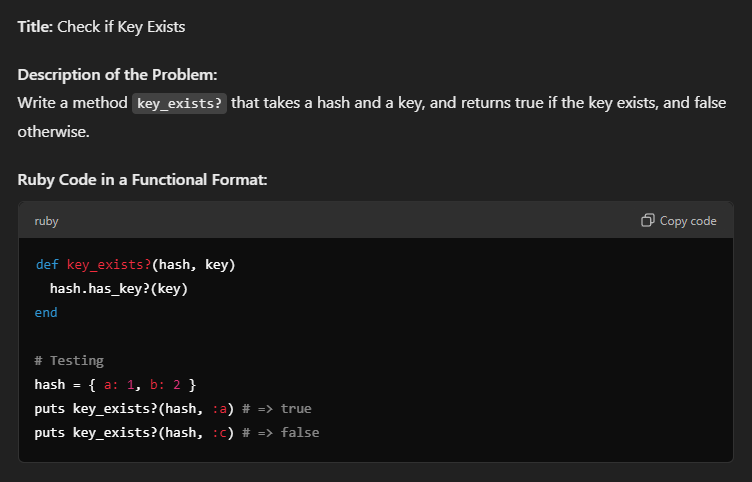

8. Sum of Values in a Hash 

    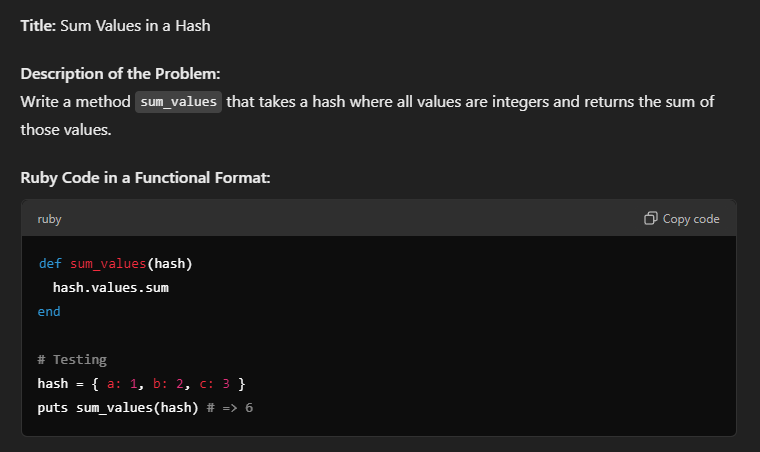

9. Group by Length 

    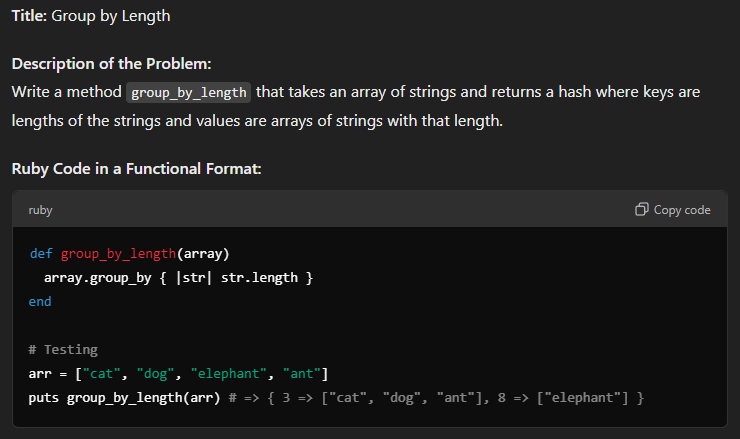

10. Initialize Hash with Default Value 

    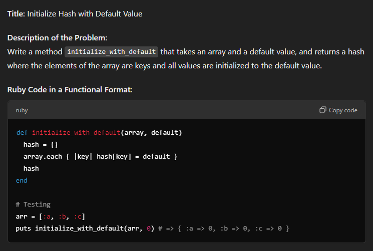

11. Find Key with Maximum Value 

    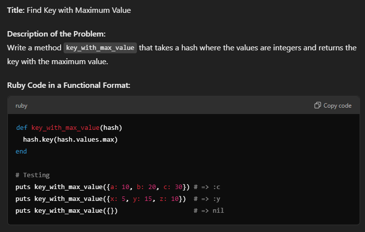

12. Invert a Hash 

    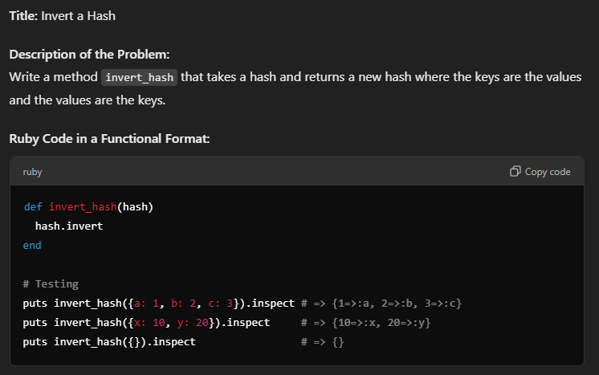

13. Count Occurences of Values 

    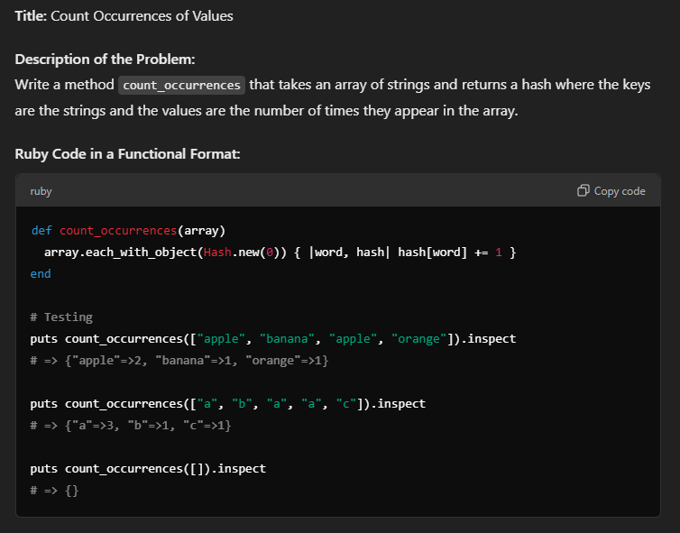

14. Find Common Keys Between Two Hashes 

    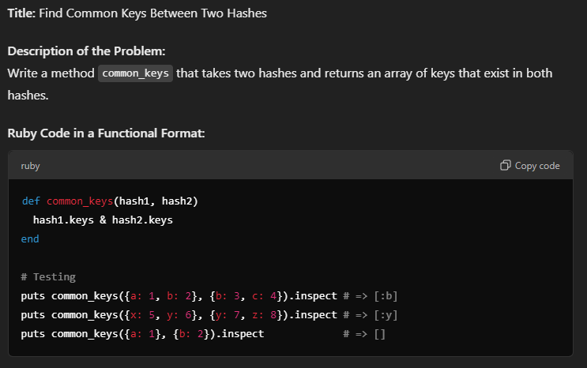

15. Find Keys with Specific Values 

    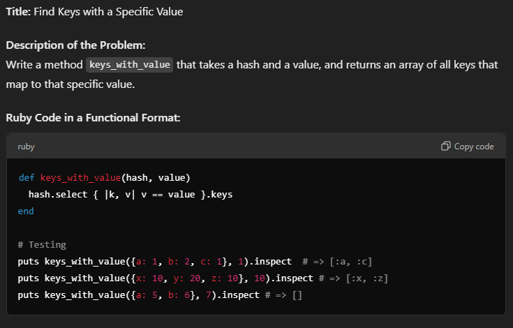

