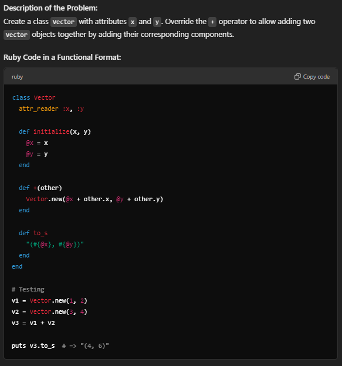

1. Define a Simple Class with Getter and Setter Methods

    

2. Class Method for Counting Instances 

    

3. Class Inheritance 

    

4. Create a Class with a Static (Class) Method 

    

5. Class with Private Methods

    

6. Class with Constructor Overloading 

    

7. Create an Interface with Modules 

    

8. Class Inheritance with Super Keyword 

    

9. Create a Class with Read-Only Attribute 

    

10. Overriding Operators 

    

11. Abstract Class with Inheritance 

    

12. Class with Class Variables and Methods 

    

13. Create a Singleton Class 

    

14. Encapsulation with Protected Methods 

    

15. Polymorphism with Duck Typing 

    

